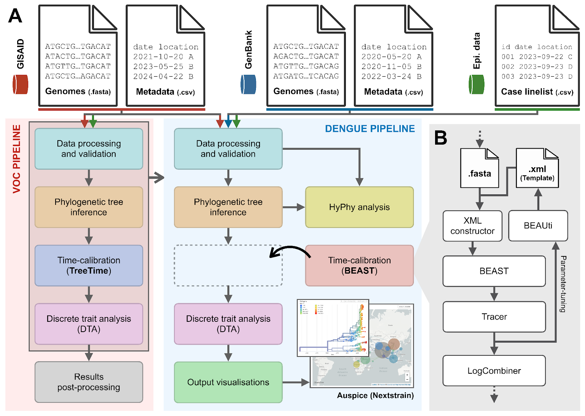

# Dengue pipeline

To run this pipeline load one of the following two scenes into GRAPEVNE and build the workflow. 
- `Dengue_DTA.json` provides the mainline workflow, up to and including visualisation of the DTA analysis (see figure below). This provides a much shorter pipeline that should complete within 30-60 mins.
- `Dengue_HyPhy.json` provides the full workflow, including HyPhy components for evolutionary hypothesis testing. This will take significantly longer to run (typically overnight).

You will need to set the (absolute) path to the following files, which should be retrieved from GISAID. You can do this by modifying the `folder` parameter of the `LinkLocalFolder` module, which will be visible in GRAPEVNE as one of the first modules in the workflow.
- `gisaid_arbo_2024_11_18_17.fasta`
- `gisaid_arbo_2024_11_18_17.tsv`

Note that, due to the size of the workflow we do not recommend running them through the `Test Build` facility, but rather `Build As A Workflow` and then run using the `run.sh` scripts (see [GRAPEVNE](https://github.com/kraemer-lab/GRAPEVNE) for documentation).

_Note: The pipelines must currently be run using only a single core due to rule dependencies. We are working to resolve this._

## Method

**Figure**: Design and implementation of analytical pipelines for reconstructing the spread of SARS-CoV-2 Variants of Concerns (VOCs) and Dengue virus. (A) The red panel illustrates the high-level structure of the SARS-CoV-2 VOC pipeline, integrating genomic data from GISAID (red arrow) and epidemiological data from other sources (e.g., case data from OWID [ref]; green arrow) to infer the historical dispersal patterns of the virus at a global scale. This pipeline serves as a template (grey box) for the Dengue pipeline in the blue panel, with three key modifications: (i) the time-calibration module based on TreeTime [ref] is replaced by an equivalent module based on BEAST instead, (ii) an additional module is added to perform evolutionary hypothesis testing using HyPhy [ref], and (iii) an additional module is added to visualize output from the discrete trait analysis using auspice [ref]. (B) An expanded view of lower-level modules nested within the time-calibration module using BEAST. A FASTA file containing pathogen genomes is used as input to generate an XML file, following the configurations as specified in an XML template generated by the user through a graphic user-interface application known as BEAUti. The XML file is then used as input by BEAST to perform Markov chain Monte Carlo (MCMC) sampling. Intermediate output is visualized and assessed for convergence using Tracer. The user then has the option to either continue running the analysis and proceed with further downstream analyses (e.g., generating the maximum clade credibility (MCC) tree using LogCombiner), or to modify the XML (e.g., tuning parameters associated with prior distributions within BEAUti) and rerun the BEAST analysis in an iterative fashion.

